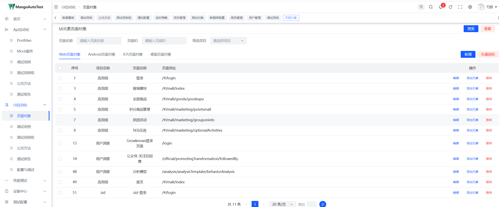
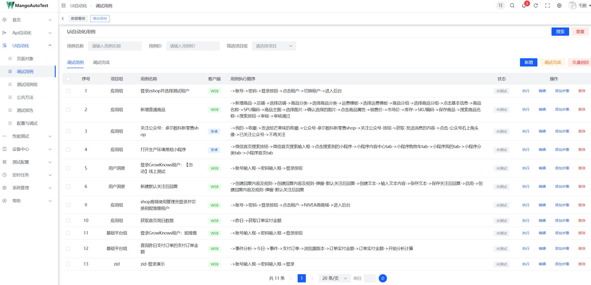
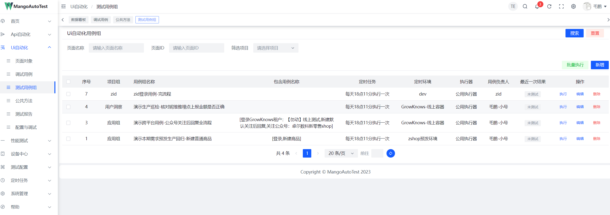
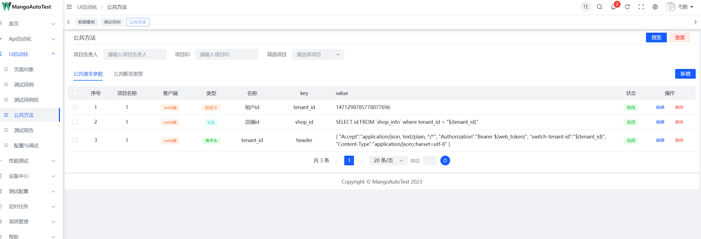
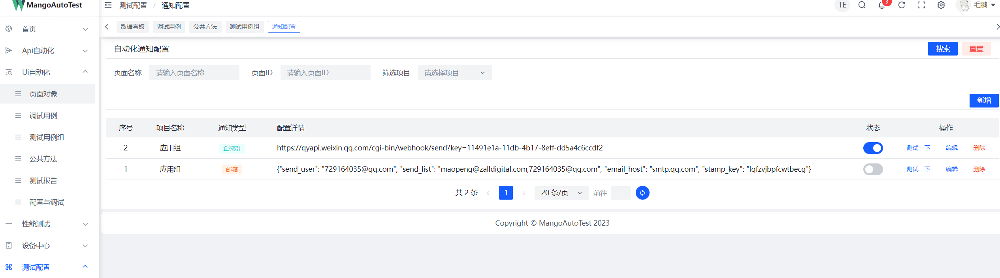
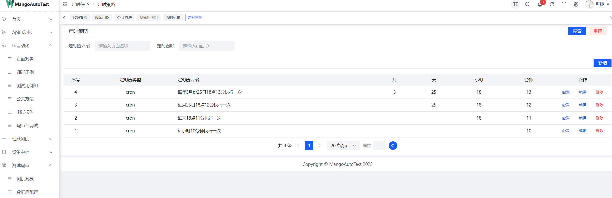
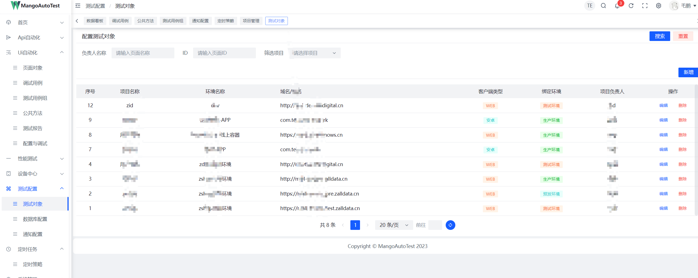
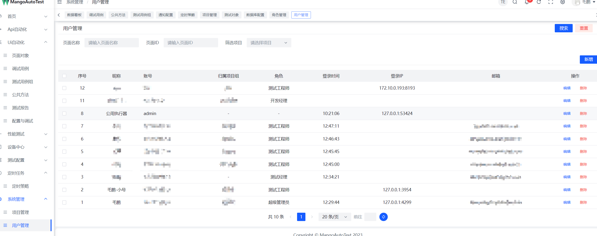

# MangoAutoTest  芒果测试平台

# 概述
###### 芒果测试平台是集UI，API，性能与一体的测试平台，解决了UI自动化测试难，API测试工具不宜用，性能测试并发度不高的问题！
###### 轻松部署，简单使用，高质量测试！
### UI自动化功能介绍：
* 基于关键字驱动的UI自动化测试平台，测试人员无需解除代码，即可完成高质量的UI自动化测试！
* 基于PO设计思想，测试数据，页面元素，产品项目组，实现全分离！多系统多页面自由组合测试用例！
* 实现人员分离，部分测试人员可以收集页面元素，部分测试人员可以专心设计测试用例，检查用例执行进度
* 支持UI与API组合用例，公用浏览器请求头，跳过复杂的登录解密，或第三方接口调用

### API自动化功能介绍
* 解决jmeter功能接口复用的问题，在一个平台上，完成项目的所有接口自动化用例
* 完善的接口依赖关系处理，可处理复杂的流程用例，例如电商平台的新建商品，发货，售后全流程
* 全面的接口断言，支持响应断言，数据库断言，python代码自定义断言
* 支持MOCK接口，可以提供给API自动化场景，或UI自动化场景调用
* 支持批量上传接口（excel导入，），无缝衔接本期新开发接口，测试驱动开发！

### 接口性能测试功能介绍
* 使用python的异步与多线程编程，最大化使用测试人员的电脑性能来完成并发任务
* 分布式性能测试！可以联合其他执行器，进行单接口并发，轻松达到数十万秒级并发！
* 直接将API自动化接口，转换成性能测试用例，方便对系统接口全面排查性能问题

### 公共功能介绍：
* 系统管理-项目管理：支持自定义配置项目，不同的项目组对应不同的产品，根据不同的产品，设置不同的UI自动，API和性能测试用例
* 系统管理-用户管理：自定义用户角色，绑定项目，维护自动化用例或查看缺陷原因
* 系统管理-角色管理：自定义不同角色，根据不同角色分配不同菜单
* 系统管理-菜单管理：分配不同菜单给角色
* 定时任务-定时策略：自定义不同的定时执行时间，提供给UI，API测试用例组进行绑定，定时自动执行用例！
* 测试配置-测试对象：根据项目绑定不同的测试环境，方便自动更好测试环境进行多环境测试
* 测试配置-数据库配置：提供给API进行数据库断言
* 测试配置-通知配置：可将测试用例执行的测试报告结果通过指定的测试方法，发送给测试&开发人员，方便排查问题！目前支持企微群，邮箱，钉钉

## 链接
##### 服务端：MangoServer（本项目）
##### 控制端：mango-console（本项目）
##### 文档：mango-help（本项目）
##### 执行端：暂不开源，提供exe可执行文件包

## 视频介绍&演示功能
##### B站视频链接

## 产品截图

## 前端-控制器部署
1. 前提准备知识：本项目需要一定前端基础知识，请确保掌握 Vue 的基础知识，以便能处理一些常见的问题。 建议在开发前先学一下以下内容，提前了解和学习这些知识，会对项目理解非常有帮助:Vue3 TypeScript VueRouter4 ArcoDesign ES6 Vitejs Pinia
2. 环境准备：Node 版本: v16.13.1 npm 版本: v6.14.5
3. 开发工具配置： Vetur - vue 开发必备 （也可以选择 Volar） ESLint - 脚本代码检查 Prettier - 代码格式化
4. cd mango-console
5. npm install
6. npm run dev

## 后端-服务器部署
1. python >=3.10.4 django == 4.1.5
2. pip install -r requirements.txt
3. python manage.py runserver 0.0.0.0:8000

## 执行器-下载
* 阿里网盘共享下载链接地址

#### 加作者微信，进芒果自动化测试群

#### 如果觉得项目对你有帮助，那就请我吃螃蟹，哈哈哈

