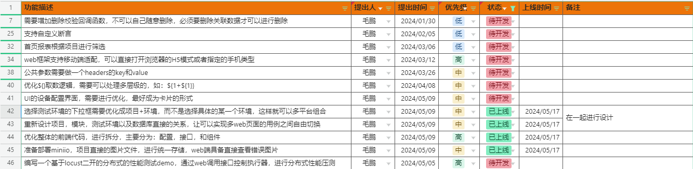
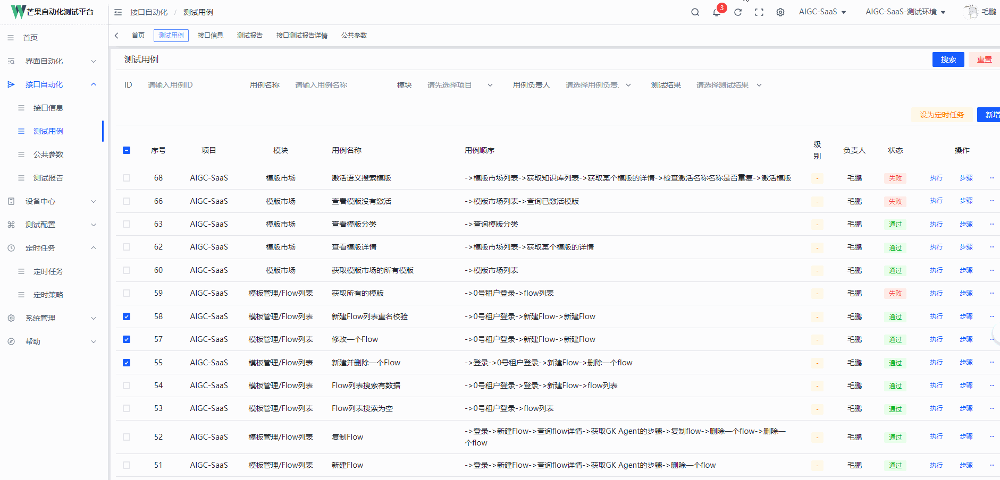

# MangoTestingPlatform  芒果测试平台
## tips：线上服务演示已上线！！(执行UI自动化请先下载执行器！在下面)
# 概述
###### 芒果测试平台是集UI，API与一体的低代码测试平台。可以通过简单的配置方式，无需编写代码，即可完成UI和API自动化。并且解决了其他很多工具的各种问题，简单易用！(UI支持web端，安卓，PC桌面，并且可以组装成一个用例)
---
### UI自动化功能介绍：
##### 基于playwright设计的UI低代码自动化平台，可以不写代码，即可完成高并发，分布式的UI自动化用例，并对测试结果进行多端通知！
* 基于关键字驱动的UI自动化测试平台，测试人员无需解除代码，即可完成高质量的UI自动化测试！
* 基于PO设计思想，元素与页面分离，页面与步骤分离，步骤与用例分离，在页面发生改变时，可以更快速的调整测试用例！
* 基于自主设计的执行器，可以远程控制无python环境的电脑，来实现分布式测试！举例：如果你的定时任务中包含1000个用例，那你登录10个执行器，每个执行器的并发10个（采用playwright的异步模式，可以高并发），假设每个用例执行1分钟，那么只需要10分钟即可完成1000个用例执行！
* 用例步骤支持多种形式，对元素操作，浏览器操作，断言，执行sql语句，进行自定义参数设置！
* 可以实现多端组合，测试用例可以组合任意客户端的步骤进行测试，比喻：先打开浏览器执行登录，接着打开微信发送消息；这种场景的自动化测试！

### API自动化功能介绍
* 解决jmeter功能接口复用的问题，如果接口发生修改，那么只需要再用例上面刷新接口的数据即可进行同步，方便更新接口！
* 使用公共方法，可以对请求值，或者是响应值，进行任意的加密解密处理；
* 支持响应结果一致性断言，响应值断言，sql断言；
* 支持录制接口，打开录制时会启动浏览器，根据你绑定的测试环境，录制该环境上所有的接口，并保存起来！

### 其他功能介绍
* 支持多项目，多客户端，多测试环境！如果公司有很多项目需要进行自动化，那么我们可以一站式解决！
* 数据库单独可以控制查询权限，增加，删除，修改权限。避免测试用例修改线上数据库！
* 支持企业微信群通知，邮箱通知，将测试结果及时发给对应的测试人员！
* 支持自定义的定时任务，可以自己配置定时触发事件，并将定时任务关联的测试用例进行执行！
* 提供60多种测试数据和加密，只需要使用：${公共变量方法}，即可获取测试数据或加密后的文本！并且用户可以动态添加想要的测试数据方法和加密方法！！！
* 提供50多种断言策略，可以进行多种形式的断言！并且用户可以动态添加想要的断言方法！！！
---
### 功能模块&一句话功能模块介绍
#### UI自动化
* 页面元素->收集元素并根据模块和页面进行分类管理
* 页面步骤->组合页面的元素步骤
* 测试用例->组合用例的场景
* 公共参数->所有用例的前置参数
* 设备配置->配置您自己账号的安卓设备和启动的浏览器类型
* 测试报告->查看UI自动化测试结果
#### API自动化
* 接口信息->收集，录制，管理接口
* 测试用例->组合接口，生成测试用例
* 公共参数->所有用例的前置参数
* 测试报告->查看API自动化测试结果
#### 设备中心
* 执行器->查看所有在线执行器的状态
#### 测试配置
* 测试项目->配置项目，根据项目管理模块，测试环境，测试用例等数据
* 测试环境->根据项目配置环境信息，可以控制环境对应的数据库权限
* 数据库配置->根据环境配置数据库
* 通知配置->根据项目配置通知
* 测试文件->根据项目上传测试需要的文件，测试用例可以使用
#### 定时任务
* 定时策略->可以配置自定义的触发时间
* 定时任务->引用定时策略的时间，触发绑定的测试用例，并进行分布式执行，完成后进行通知
#### 系统管理
* 系统设置->一些配置，可以通过web页面来进行设置，如：邮箱发送配置、API请求超时时间
* 用户管理->管理本平台的用户
* 角色管理->对用户进行区分角色
* 登录日志->查看所有人的登录情况
#### 帮助
* 公共变量->类似于jmeter的函数助手，用例执行过程中可以使用
* 断言策略->介绍断言的功能
* 帮助手册->本平台的使用介绍
---
### 功能开发计划

---
## 项目
##### 后端：MangoServer
##### 前端：mango-console
##### 执行端：MangoActuator(执行UI自动化用例。可以在任意的电脑打开执行打包的exe文件，即可在任意电脑上执行UI自动化用例！)
##### 执行端下载：https://www.alipan.com/s/8CmZdabwt4R
---
## 视频介绍&演示功能
* 演示地址：http://121.37.174.56:5173/
* 账号：自行注册
* 密码：自行注册
---
## B站视频教程（已上线）（注意查看评论）
* 地址：https://space.bilibili.com/266410261?spm_id_from=333.1007.0.0
## 部署&帮助文档&功能介绍（没会员已过期，看b站视频吧或者阅读项目根目录下的：windows运行服务文档文档）
* 语雀文档地址：https://www.yuque.com/maopeng-ipl1k/hi4b1o?# 《芒果测试平台》
---
## 功能演示gif图
* 所有功能介绍

* UI用例执行过程及测试报告

* API用例执行过程及测试报告

#### 加作者微信，进芒果自动化测试群(记得备注：git芒果测试平台。否则可能会不通过哦)
如果觉得项目对你有帮助，那就请我喝咖啡！

