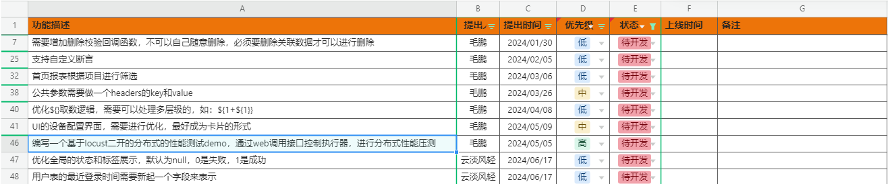

# MangoTestingPlatform  芒果测试平台
# ✨️概述
###### 芒果测试平台是集UI，API与一体的低代码测试平台。可以通过简单的配置方式，无需编写代码，即可完成UI和API自动化。并且解决了其他很多工具的各种问题，简单易用！(UI支持web端，安卓，PC桌面，并且可以组装成一个用例)
项目地址：[gitee](https://gitee.com/mao-peng/MangoTestingPlatform)    |    [github](https://github.com/maopengg/MangoTestingPlatform) 

您的星星是对我最大的支持💖

---
## 自动化可实现功能介绍
#### UI自动化功能介绍：
* 基于关键字驱动的UI自动化测试平台，测试人员无需解除代码，即可完成高质量的UI自动化测试！
* 支持录制元素，定位准确，支持任意类型的元素定位，无缝衔接iframe等问题
* 基于PO设计思想，元素与页面分离，页面与步骤分离，步骤与用例分离，在页面发生改变时，可以更快速的调整测试用例！
* 基于自主设计的执行器，可以远程控制无python环境的电脑，来实现分布式测试！举例：如果你的定时任务中包含1000个用例，那你登录10个执行器，每个执行器的并发10个（采用playwright的异步模式，可以高并发），假设每个用例执行1分钟，那么只需要10分钟即可完成1000个用例执行！
* 用例步骤支持多种形式，对元素操作，浏览器操作，断言，执行sql语句，进行自定义参数设置！
* 可以实现多端组合，测试用例可以组合任意客户端的步骤进行测试，比喻：先打开浏览器执行登录，接着打开微信发送消息；这种场景的自动化测试！

#### API自动化功能介绍：
* 解决jmeter功能接口复用的问题，如果接口发生修改，那么只需要再用例上面刷新接口的数据即可进行同步，方便更新接口！
* 使用公共方法，可以对请求值，或者是响应值，进行任意的加密解密处理；
* 支持响应结果一致性断言，响应值断言，sql断言；
* 支持录制接口，打开录制时会启动浏览器，根据你绑定的测试环境，录制该环境上所有的接口，并保存起来！

#### 其他功能介绍：
* 支持多项目，多客户端，多测试环境！如果公司有很多项目需要进行自动化，那么我们可以一起解决！
* 数据库单独可以控制查询权限，增加，删除，修改权限。避免测试用例修改线上数据库！
* 支持企业微信群通知，邮箱通知，将测试结果及时发给对应的测试人员！
* 支持自定义的定时任务，可以自己配置定时触发事件，并将定时任务关联的测试用例进行执行！
* 提供60多种测试数据和加密，只需要使用：${公共变量方法}，即可获取测试数据或加密后的文本！并且用户可以动态添加想要的测试数据方法和加密方法！！！
* 提供50多种断言策略，可以进行多种形式的断言！并且用户可以动态添加想要的断言方法！！！
---
## 功能模块&一句话模块使用逻辑介绍
#### UI自动化
* 页面元素->管理项目的所有页面，并添加元素到页面
* 页面步骤->组合页面上的元素形成一个步骤
* 测试用例->组合一个项目的所有步骤，形成一个完成测试用例
* 公共参数->所有用例的前置参数
* 设备配置->配置您自己账号的安卓设备和启动的浏览器类型，以启动浏览器或设备
* 测试报告->查看UI自动化测试结果
#### API自动化
* 接口信息->收集，录制，管理接口信息
* 测试用例->组合接口形成测试用例
* 公共参数->所有用例的前置参数
* 测试报告->查看API自动化测试结果
#### 设备中心
* 执行器->查看所有在线执行器的状态
#### 测试配置
* 项目配置->配置项目，根据项目管理模块，测试环境，测试用例等数据
* 项目产品->产品与项目绑定，举例：一个项目有前端页面和后端控制页面，那么可以组合测试用例进行测试
* 测试环境->与项目产品绑定，根据项目配置环境信息，可以控制环境对应的数据库权限等
* 数据库配置->与测试环境绑定，设置数据库连接信息
* 通知配置->与测试绑定，根据定时任务执行的环境进行通知
* 测试文件->根据项目上传测试需要的文件，测试用例可以使用该文件进行测试
#### 定时任务
* 定时策略->可以配置自定义的触发时间
* 定时任务->引用定时策略的时间，触发绑定的测试用例，并进行分布式执行，完成后进行通知
#### 系统管理
* 系统设置->一些配置，可以通过web页面来进行设置，如：邮箱发送配置、API请求超时时间
* 用户管理->管理本平台的用户
* 角色管理->对用户进行区分角色
* 登录日志->查看所有人的登录情况
#### 帮助
* 公共变量->类似于jmeter的函数助手，用例执行过程中可以使用
* 断言策略->介绍断言的功能
* 帮助手册->本平台的使用介绍
---
## 后续开发计划

---
## 项目
* 后端：MangoServer
* 前端：mango-console
* 执行端：MangoActuator(执行UI自动化用例。可以在任意的电脑打开执行打包的exe文件，即可在任意电脑上执行UI自动化用例！)
---
## 视频介绍&演示功能
#### 重要重要重要(体验UI自动化的步骤)：注册账号-->登录-->选择测试环境，在右上角，选择为线上环境-->体验UI下载执行-->执行器登录（账号密码和web管理平台一致）-->在模块：前端自动化-配置中创建web端启动配置，注意，不必填可不填！！！-->完成点击执行用例-->查看测试结果-->
* 演示地址：http://121.37.174.56:5173/
* 账号：自行注册(请查看上面的重要步骤！否则无法体验)
* 密码：自行注册(请查看上面的重要步骤！否则无法体验)
* 执行端下载：https://www.alipan.com/s/8CmZdabwt4R
---
## 帮助
* B站视频教程（windows部署）：https://space.bilibili.com/266410261?spm_id_from=333.1007.0.0
* 语雀全功能使用介绍（会员已过期）：语雀文档地址：https://www.yuque.com/maopeng-ipl1k/hi4b1o?# 《芒果测试平台》
---
## 功能演示gif图
* 所有功能介绍

* UI用例执行过程及测试报告

* API用例执行过程及测试报告

## 加作者微信，进芒果自动化测试群(记得备注：git芒果测试平台。否则可能会不通过哦)
如果觉得项目对你有帮助，那就请我喝咖啡！

